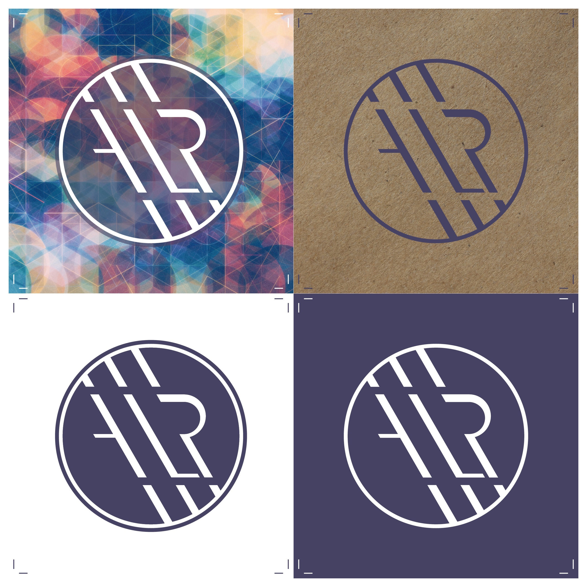

--- 
author: 
    - forname: Amélie
    - surname: Levasseur-Raymond
    - institution: Université de Montréal
teacher: 
  - forname: Margot
    surname: Mellet
title: D'infographiste à archiviste -- Fusion entre le papier et le numérique
subtitle: Proposition de projet d'écriture
year: 2023
month: Mars
day: 21
cours:
  - id: FRA3825
    title: Pratiques de l'édition numérique
nocite: '@*'
---

## Besoin d'écriture

Ayant passé 20 ans de ma carrière comme infographiste, ce sont surtout les aspects visuel et technique que j'aimerais explorer. [Mon espace web actuel](http://amelielr.ca) est bâti avec le CMS Drupal, mais avec le temps, certaines fonctionnalités se sont brisées et ne me permettent plus d'afficher ou même de gérer mon site comme je l'avais conçu au départ. Cet espace personnel est donc dû pour une refonte, autant du point de vue technique afin de le simplifier, que dans son contenu pour y ajouter les branches issues de mon nouveau parcours en archivistique et en humanités numériques. Je souhaite y présenter les projets accomplis et en développement, mais aussi pouvoir m'en servir comme recueil de publications, d'outils ou de toute autre référence pertinente, question de regrouper et classer tout ce qui pourrait être utile à un seul et même endroit, un peu à la manière de Pinterest.

Bien qu'à long terme je compte pouvoir y présenter ces multiples facettes et intérêts qui me définissent en me servant de cet espace comme portfolio et pour le partage d'information, je me concentrerai principalement, dans le cadre de cet exercice, à bâtir la structure et définir le style qui me représentera. Pour ce qui est du contenu, je m'attarderai d'abord à rapatrier l'information publiée sur ma page Facebook, [L'1nfograph3](http://facebook.com/1nfograph3), afin d'en assurer la pérennité. J'espère ensuite construire une page qui me permettra d'y rassembler diverses références que je pourrai classer par sujet. J'utiliserai pour se faire un recueil de lois monté dans Zotero dans le cadre du cours *ARV3053-Aspects juridiques des archives et de l’information* suivi à la session d'hiver 2022. Le reste de l'arborescence (présentation, cv, portfolio, projets, etc.) ne sera que partiel selon le temps que j'aurai à y consacrer.

## Objectifs 

Mon but sera donc principalement d'expérimenter les divers outils vus durant la session (et mes autres cours) afin de voir comment structurer une écriture sans devoir mettre de côté la créativité visuelle. Jusqu'à présent, je découvre que le langage Markdown est en effet facile d'utilisation pour sémantiser les textes, mais j'aimerais pousser plus loin afin de voir comment l'intégrer aux autres outils pour créer des pages ayant une structure plus libre et personnelle. Considérant la contrainte de thème, j'espère tout de même réussir à détourner le thème choisi (Cupper) afin de le rendre à mon image et adapté à mes besoins. Mes connaissances en html/css me seront utiles ici.

## Inspiration

Pour ce qui est de l'inspiration, je partirai bien sûr de l'image que j'ai déjà développée, mais je souhaite tout de même la mettre à jour en retravaillant la palette de couleurs. J'aime particulièrement les fonds plus foncés (pour leur économie d'énergie à l'affichage), comme c'est le cas dans le carnet d'Antoine Fauchié [@fauchie_quaternumnet_2019]. La typographie restera la même, Roboto, mais je pense peut-être pencher davantage vers le Roboto Slab qui s'apparente à la police de caractère Courier pour aller vers un style plus rétro numérique, en souvenir de mes débuts sur WordPerfect il y a de cela bien longtemps déjà il me semble. Les formes géographiques, combinées à du code ASCII pour une touche numérique et une texture de papier pour rappeler les archives pourraient être une dualité intéressante.

\newpage

## Bibliographie